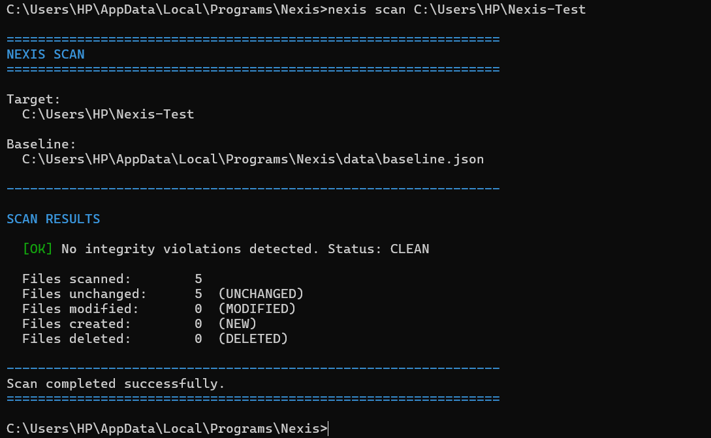

# Nexis

**File Integrity & Host Intrusion Detection Monitor**


---

## Table of Contents

- [Overview](#overview)
- [Features](#features)
- [Architecture](#architecture)
- [Technologies Used](#technologies-used)
- [Project Structure](#project-structure)
- [Installation](#installation)
- [Running Nexis](#running-nexis)
- [Testing](#testing)
- [Example Workflow](#example-workflow)
- [Screenshots](#screenshots)
- [Security Considerations](#security-considerations)
- [Limitations](#limitations)
- [Future Enhancements](#future-enhancements)
- [License](#license)

---

## Overview

Nexis is a cybersecurity and DFIR (Digital Forensics & Incident Response) tool that monitors file system integrity to detect unauthorized modifications, additions, and deletions. It establishes a trusted cryptographic baseline of files in a target directory, then compares the current state against that baseline to identify integrity violations.

File integrity monitoring is a foundational security control used in intrusion detection systems, compliance auditing, and forensic investigations. Unauthorized changes to critical files — whether caused by malware, insider threats, or configuration drift — can be detected early by comparing cryptographic hashes against a known-good baseline. Nexis provides this capability as a lightweight, self-contained CLI application.

Nexis uses **SHA-256 cryptographic hashing** with streaming I/O to fingerprint every file in a monitored directory. It supports on-demand integrity scans, real-time directory monitoring via Java's WatchService API, structured security event reporting, and persistent event logging for post-incident investigation.

---

## Features

### Baseline Creation & Storage
- Recursively scans a target directory to discover all regular files.
- Computes SHA-256 cryptographic hashes for each file using buffered streaming I/O (files are never loaded entirely into memory).
- Persists the baseline to a versioned JSON file (`data/baseline.json`).
- Baseline entries are normalized and sorted for cross-platform consistency.

### Integrity Scanning
- Compares the current filesystem state against the stored baseline.
- Classifies every file into one of four integrity states:

  | Status | Meaning |
  |---|---|
  | `UNCHANGED` | File exists and its SHA-256 hash matches the baseline |
  | `MODIFIED` | File exists but its SHA-256 hash differs from the baseline |
  | `NEW` | File exists on disk but has no baseline entry |
  | `DELETED` | Baseline entry exists but the file is no longer on disk |

- Reports hash mismatches with expected vs. actual SHA-256 values.
- Returns exit code `0` for clean scans and `1` when differences are detected.

### Real-Time Monitoring (Watch Mode)
- Monitors a directory in real time using Java's `WatchService` API.
- Detects file creation, modification, and deletion events as they occur.
- Performs live baseline comparison on modified files to distinguish routine changes from integrity violations.
- Runs until manually stopped with Ctrl+C.

### Security Event Alerting
- Maps filesystem changes to structured security events with severity levels:

  | Event Type | Severity | Trigger |
  |---|---|---|
  | `FILE_CREATED` | `INFO` | A new file appears in the monitored directory |
  | `FILE_MODIFIED` | `WARNING` | An existing monitored file is changed |
  | `FILE_DELETED` | `WARNING` | A monitored file is removed |
  | `INTEGRITY_VIOLATION` | `CRITICAL` | A file's SHA-256 hash differs from its baseline |
  | `MONITORING_ERROR` | `ERROR` | An unexpected error in the real-time watch loop |
  | `SYSTEM_ERROR` | `ERROR` | An unexpected error during a scan operation |

- `CRITICAL` and `ERROR` events are prefixed with `!!` for visual prominence.

### Persistent Security Logging
- All security events are appended to `logs/nexis.log` in a pipe-delimited format.
- Log directory and file are created automatically on first write.
- Events are appended — existing log entries are never overwritten.
- Logging failures are reported to `stderr` and never crash the monitoring engine.

### Security Event Reporting & Investigation
- Generates structured security reports from persisted events.
- Supports filtering by severity, event type, and file path for forensic investigation.
- Displays summary counts, event breakdown by type, and detailed critical event listings.
- Stored events can be cleared when no longer needed.

### CLI Interface
- Built with picocli for professional command-line argument parsing.
- Custom startup screen and help display.
- Strictly 7-bit US-ASCII compliant output to prevent mojibake across Windows PowerShell, CMD, VS Code terminal, and standard Java console environments.
- ANSI color support with automatic detection (respects `NO_COLOR`, `CLICOLOR`, `CLICOLOR_FORCE`, and `picocli.ansi` conventions).
- Comprehensive input validation with informative error messages.

### Error Handling
- Inaccessible files are reported as errors, never silently skipped.
- Scan errors are recorded in the comparison result without aborting the scan.
- Symbolic links are not followed (prevents traversal attacks).

---

## Technologies Used

| Technology | Version | Purpose |
|---|---|---|
| **Java** | 26+ | Core language and runtime |
| **Maven** | 3.9+ | Build system and dependency management |
| **picocli** | 4.7.6 | CLI framework for command parsing and help generation |
| **Gson** | 2.12.1 | JSON serialization/deserialization for baselines and events |
| **JUnit Jupiter** | 5.13.4 | Unit and integration testing framework |
| **SHA-256** (`java.security.MessageDigest`) | — | Cryptographic hashing via Java's standard security API |
| **Java NIO WatchService** | — | Real-time filesystem event monitoring |

---

## Project Structure

```
Nexis/
├── pom.xml
├── README.md
├── LICENSE
├── statement.md
├── .gitignore
├── data/                                  # Runtime data (gitignored)
│   ├── baseline.json                      # Stored file integrity baseline
│   └── events.json                        # Persisted security events
├── logs/                                  # Runtime logs (gitignored)
│   └── nexis.log                          # Append-only security event log
└── src/
    ├── main/java/com/nexis/
    │   ├── Main.java                      # Application entry point
    │   ├── cli/
    │   │   ├── NexisCLI.java              # Root picocli command & help
    │   │   ├── BaselineCommand.java       # 'baseline' subcommand
    │   │   ├── ScanCommand.java           # 'scan' subcommand + event dispatch
    │   │   ├── WatchCommand.java          # 'watch' subcommand + event dispatch
    │   │   ├── ReportCommand.java         # 'report' subcommand (investigation)
    │   │   ├── ResultFormatter.java       # Structured scan result formatter
    │   │   └── CliUI.java                 # ASCII/ANSI presentation utilities
    │   ├── baseline/
    │   │   ├── BaselineEntry.java         # Path → SHA-256 record (record type)
    │   │   ├── BaselineManager.java       # In-memory baseline management
    │   │   ├── BaselineStorage.java       # Versioned JSON persistence
    │   │   └── BaselineStorageException.java  # Storage error handling
    │   ├── integrity/
    │   │   ├── HashCalculator.java         # SHA-256 streaming file hasher
    │   │   ├── ComparisonEngine.java       # Baseline vs. current comparison
    │   │   ├── ComparisonEntry.java        # Per-file comparison result
    │   │   ├── ComparisonResult.java       # Structured result container
    │   │   └── ComparisonStatus.java       # UNCHANGED/MODIFIED/NEW/DELETED enum
    │   ├── monitor/
    │   │   ├── DirectoryMonitor.java       # WatchService real-time monitor
    │   │   ├── MonitorEvent.java           # Raw filesystem event (record type)
    │   │   └── MonitorEventType.java       # CREATED/MODIFIED/DELETED enum
    │   ├── alert/
    │   │   ├── EventType.java              # Security event classification enum
    │   │   ├── Severity.java               # INFO/WARNING/CRITICAL/ERROR enum
    │   │   ├── SecurityEvent.java          # Immutable security event value object
    │   │   ├── AlertManager.java           # CLI alert formatter and printer
    │   │   └── SecurityLogger.java         # Append-only log file writer
    │   ├── report/
    │   │   ├── EventRepository.java        # In-memory event store with query/filter
    │   │   ├── EventStorage.java           # Versioned JSON event persistence
    │   │   └── ReportGenerator.java        # Structured security report renderer
    │   └── scanner/
    │       └── FileScanner.java            # Recursive file discovery (no symlinks)
    └── test/java/com/nexis/               # 186 unit/integration tests (20 classes)
        ├── alert/
        ├── baseline/
        ├── cli/
        ├── integrity/
        ├── monitor/
        ├── report/
        └── scanner/
```

**Event flow:**
```
ScanCommand / WatchCommand  →  SecurityEvent
                                    ├── AlertManager     → CLI alerts
                                    ├── SecurityLogger   → logs/nexis.log
                                    └── EventRepository  → ReportGenerator → CLI report
```

---

## Architecture

```
┌─────────────────────────────────────────────────────────────┐
│                     USER INTERFACE LAYER                    │
│                                                             │
│  ┌────────────┐ ┌────────────┐ ┌────────────┐ ┌──────────┐  │
│  │  Baseline  │ │    Scan    │ │    Watch   │ │  Report  │  │
│  │   Command  │ │   Command  │ │   Command  │ │ Command  │  │
│  └────────────┘ └────────────┘ └────────────┘ └──────────┘  │
│                     Nexis CLI / picocli                     │
└────────────────────────────┬────────────────────────────────┘
                             ▼
┌─────────────────────────────────────────────────────────────┐
│                     CORE ENGINE LAYER                       │
│                                                             │
│  ┌──────────────┐ ┌──────────────┐ ┌─────────────────────┐  │
│  │   Baseline   │ │   Scanner    │ │     Integrity       │  │
│  │  Management  │ │    Engine    │ │     Detection       │  │
│  └──────────────┘ └──────────────┘ └─────────────────────┘  │
│                                                             │
│  ┌──────────────┐ ┌──────────────┐                          │
│  │   Monitor    │ │    Alert     │                          │
│  │  WatchService│ │ Event Engine │                          │
│  └──────────────┘ └──────────────┘                          │
└────────────────────────────┬────────────────────────────────┘
                             ▼
┌─────────────────────────────────────────────────────────────┐
│                  DATA & PERSISTENCE LAYER                   │
│                                                             │
│  ┌──────────────┐ ┌──────────────┐ ┌─────────────────────┐  │
│  │ SHA-256 Hash │ │   Baseline   │ │    Security Event   │  │
│  │  Calculation │ │ JSON Storage │ │    Log / Storage    │  │
│  └──────────────┘ └──────────────┘ └─────────────────────┘  │
│                                                             │
│             File System / Persistent Data                   │
└─────────────────────────────────────────────────────────────┘
```

### Component Summary

| Layer | Classes | Responsibility |
|---|---|---|
| **CLI Layer** | `NexisCLI`, `*Command`, `CliUI`, `ResultFormatter` | Command parsing, user interaction, output formatting |
| **Scan Engine** | `ComparisonEngine`, `ComparisonResult`, `ComparisonEntry` | Baseline vs. current filesystem comparison; classifies UNCHANGED / MODIFIED / NEW / DELETED |
| **Hash Calculator** | `HashCalculator` | SHA-256 streaming hash computation (8 KB buffer, never loads full file) |
| **File Scanner** | `FileScanner` | Recursive file discovery; symbolic links are never followed |
| **Baseline** | `BaselineManager`, `BaselineStorage`, `BaselineEntry` | In-memory baseline store; versioned JSON persistence in `data/baseline.json` |
| **Monitor** | `DirectoryMonitor`, `MonitorEvent` | Real-time filesystem event loop via Java `WatchService` |
| **Alert & Logging** | `AlertManager`, `SecurityLogger`, `SecurityEvent` | Structured security events; CLI display; append-only log in `logs/nexis.log` |
| **Reporting** | `EventRepository`, `EventStorage`, `ReportGenerator` | Persisted event store in `data/events.json`; filtered security reports |

---

## Installation

### Prerequisites

- **JDK 26+** — [Download from Oracle](https://www.oracle.com/java/technologies/downloads/) or use a compatible distribution
- **Maven 3.9+** — [Download from Apache Maven](https://maven.apache.org/download.cgi)
- **Git** — for cloning the repository

### Build

```bash
# Clone the repository
git clone https://github.com/Tanmay-Bhatnagar22/Nexis.git
cd Nexis

# Build the project (compiles sources, runs tests, packages JAR)
mvn clean package
```

The compiled classes will be available in the `target/` directory.

---

## Running Nexis

All commands are run from the project root directory using Maven:

```bash
# Show startup screen
mvn -q exec:java -Dexec.mainClass="com.nexis.Main"

# Show help
mvn -q exec:java -Dexec.mainClass="com.nexis.Main" -Dexec.args="help"

# Show version
mvn -q exec:java -Dexec.mainClass="com.nexis.Main" -Dexec.args="--version"
```

### 1. Create a Baseline

Scan a directory and save the trusted baseline:

```bash
mvn -q exec:java -Dexec.mainClass="com.nexis.Main" -Dexec.args="baseline C:\path\to\directory"
```

Example output:
```
===============================================================
NEXIS BASELINE CREATED
===============================================================

[OK] Baseline created successfully.
  Target:    C:\Users\Tanmay\Documents
  Files:     47
  Saved to:  C:\...\data\baseline.json

---------------------------------------------------------------
```

### 2. Run an Integrity Scan

Compare the current state of a directory against the saved baseline:

```bash
mvn -q exec:java -Dexec.mainClass="com.nexis.Main" -Dexec.args="scan C:\path\to\directory"
```

Example output (differences detected):
```
===============================================================
NEXIS SCAN
===============================================================

Target:
  C:\Users\Tanmay\Documents

Baseline:
  C:\...\data\baseline.json

---------------------------------------------------------------

[CRITICAL] INTEGRITY VIOLATION DETECTED (MODIFIED)

  File:
    report.pdf

  Expected SHA-256:
    a1b2c3d4...

  Actual SHA-256:
    e5f6a7b8...

[INFO] NEW FILE DETECTED (NEW)
  File: suspicious.exe

[WARN] FILE DELETED (DELETED)
  File: old_config.txt

---------------------------------------------------------------

SUMMARY

  Status: DIFFERENCES DETECTED

  Files scanned:        47
  Files unchanged:      44  (UNCHANGED)
  Files modified:       1   (MODIFIED)
  Files created:        1   (NEW)
  Files deleted:        1   (DELETED)
  Integrity violations: 1

===============================================================
```

- Exit code `0` = CLEAN (no differences)
- Exit code `1` = DIFFERENCES DETECTED or error

### 3. Real-Time Monitoring

Monitor a directory for changes in real time:

```bash
mvn -q exec:java -Dexec.mainClass="com.nexis.Main" -Dexec.args="watch C:\path\to\directory"
```

Example output:
```
===============================================================
NEXIS WATCH
===============================================================

Monitoring:
  C:\Users\Tanmay\Documents

Status:
  ACTIVE

Press Ctrl+C to stop monitoring.

---------------------------------------------------------------

[INFO] Monitoring started.
  Alerts and events are logged to: C:\...\logs\nexis.log

   [2026-09-13 14:32:18] [INFO]     FILE_CREATED         Path: C:\...\report.txt  Details: File creation detected.
!! [2026-09-13 14:35:42] [CRITICAL] INTEGRITY_VIOLATION  Path: C:\...\config.xml  Details: SHA-256 hash differs from baseline.
```

Press **Ctrl+C** to stop monitoring.

### 4. View Security Reports

```bash
# View complete security report
mvn -q exec:java -Dexec.mainClass="com.nexis.Main" -Dexec.args="report"

# Filter by severity
mvn -q exec:java -Dexec.mainClass="com.nexis.Main" -Dexec.args="report --severity CRITICAL"

# Filter by event type
mvn -q exec:java -Dexec.mainClass="com.nexis.Main" -Dexec.args="report --type INTEGRITY_VIOLATION"

# Filter by file path
mvn -q exec:java -Dexec.mainClass="com.nexis.Main" -Dexec.args="report --path C:\path\to\file.txt"

# Clear stored events
mvn -q exec:java -Dexec.mainClass="com.nexis.Main" -Dexec.args="report --clear"
```

Example report output:
```
===============================================================
NEXIS SECURITY REPORT
===============================================================

Total Events       : 3
Critical Events    : 1
Warnings           : 1
Errors             : 0
Informational      : 1

EVENT BREAKDOWN
---------------------------------------------------------------
FILE_CREATED          1
FILE_DELETED          1
INTEGRITY_VIOLATION   1

CRITICAL EVENTS
---------------------------------------------------------------
[14:35:42] INTEGRITY_VIOLATION
Path: C:\...\config.xml
Details: SHA-256 hash differs from baseline - possible tampering detected.
```

---

## Testing

Run the complete test suite:

```bash
mvn clean test
```

The test suite includes **186 tests across 20 test classes** covering:

| Component | Tests | Validates |
|---|:---:|---|
| `HashCalculator` | 9 | SHA-256 correctness, known digests, streaming of large files, error handling |
| `ComparisonEngine` | 18 | Detection of unchanged/modified/new/deleted files, nested directories, mixed states, path normalization |
| `FileScanner` | 8 | Recursive discovery, directory exclusion, symlink avoidance, sorted output |
| `DirectoryMonitor` | 9 | Real-time create/modify/delete detection, clean shutdown, input validation |
| `BaselineManager` | 14 | Add/update/remove entries, save/load round-trip, corruption handling |
| `BaselineStorage` | 9 | JSON serialization, schema versioning, path normalization, error handling |
| `SecurityEvent` | 13 | Factory methods, path normalization, equality, null safety |
| `AlertManager` | 9 | CLI formatting, severity prefixes, ANSI markers |
| `SecurityLogger` | 8 | Log file creation, append-only writes, graceful failure handling |
| `EventRepository` | 17 | Add/query/filter, persistence round-trip, schema validation, thread safety |
| `EventStorage` | 7 | JSON persistence, round-trip integrity, corruption handling |
| `ReportGenerator` | 7 | Summary statistics, critical event extraction, empty reports |
| `CliUI` | 8 | Startup screen, help display, ASCII compliance, visual markers |
| `BaselineCommand` | 4 | End-to-end baseline creation, error handling |
| `ScanCommand` | 8 | End-to-end scanning with modified/new/deleted files, error paths |
| `WatchCommand` | 9 | Real-time event dispatch, integrity violation detection, graceful error handling |
| `ReportCommand` | 10 | Report generation, filtering, clearing, error handling |
| `ResultFormatter` | 5 | Clean/dirty scan formatting, relative paths, ASCII rendering |
| `EventType` | 8 | Enum constants and valueOf round-trip |
| `Severity` | 6 | Enum constants and valueOf round-trip |

---

## Example Workflow

1. **Build the project:**
   ```bash
   mvn clean package
   ```

2. **Create a baseline** of the directory you want to monitor:
   ```bash
   mvn -q exec:java -Dexec.mainClass="com.nexis.Main" -Dexec.args="baseline C:\Users\Tanmay\Documents"
   ```

3. **Run an integrity scan** — should report CLEAN since no files have changed:
   ```bash
   mvn -q exec:java -Dexec.mainClass="com.nexis.Main" -Dexec.args="scan C:\Users\Tanmay\Documents"
   ```

4. **Modify, add, or delete a file** in the monitored directory.

5. **Scan again** — Nexis will detect and report the changes:
   ```bash
   mvn -q exec:java -Dexec.mainClass="com.nexis.Main" -Dexec.args="scan C:\Users\Tanmay\Documents"
   ```

6. **Review the security report** for detailed investigation:
   ```bash
   mvn -q exec:java -Dexec.mainClass="com.nexis.Main" -Dexec.args="report"
   ```

7. **Optionally, start real-time monitoring** for continuous protection:
   ```bash
   mvn -q exec:java -Dexec.mainClass="com.nexis.Main" -Dexec.args="watch C:\Users\Tanmay\Documents"
   ```

---

## Screenshots

| Screenshot | Description |
|---|---|
| [CLI Startup Screen](#1-cli-startup-screen) | Nexis startup banner displayed when launched without arguments |
| [Help Screen](#2-help-screen) | Available commands and usage information |
| [Baseline Creation](#3-baseline-creation) | Successful baseline creation with file count and save path |
| [Clean Scan](#4-clean-scan) | Integrity scan showing all files unchanged |
| [Integrity Violations](#5-integrity-violations) | Scan detecting modified, new, and deleted files |
| [Watch Mode](#6-watch-mode) | Real-time monitoring with live event alerts |
| [Security Report](#7-security-report) | Structured report with severity breakdown and critical event details |
| [Log File](#8-log-file) | Contents of `logs/nexis.log` showing persistent event records |

---

### 1. CLI Startup Screen
Nexis startup banner displayed when launched without arguments.


---

### 2. Help Screen
Complete command reference, options, and usage information.


---

### 3. Baseline Creation
Establishing a trusted SHA-256 cryptographic baseline of monitored files.


---

### 4. Clean Scan
Integrity scan showing all files matching their baseline hashes (status: CLEAN).



---

### 5. Integrity Violations
Detection of modified files (SHA-256 hash mismatch), newly created files, and deleted files.


---

### 6. Watch Mode
Real-time directory monitoring capturing filesystem modifications and alerting on integrity violations.


---

### 7. Security Report
Structured report showing event statistics, breakdown by category, and detailed critical events.


---

### 8. Log File
Contents of `logs/nexis.log` showing persistent pipe-delimited security audit records.


---

## Security Considerations

- **SHA-256 Cryptographic Hashing** — Nexis uses SHA-256 (via Java's standard `java.security.MessageDigest` API) to compute file fingerprints. SHA-256 is a member of the SHA-2 family and is widely used in security applications. It produces a 256-bit (64 hex character) digest that is computationally infeasible to forge.
- **No Weak Hashes** — Nexis does not use MD5 or SHA-1, which have known collision vulnerabilities.
- **Streaming I/O** — Files are hashed using a fixed 8KB buffer; file contents are never loaded entirely into memory, making Nexis suitable for large files.
- **No Symbolic Link Following** — The file scanner uses `LinkOption.NOFOLLOW_LINKS` to prevent directory traversal attacks via symlinks.
- **Baseline Integrity** — The baseline file (`data/baseline.json`) should be stored in a protected location. If an attacker can modify the baseline, they can mask unauthorized changes. Nexis does not currently encrypt or sign the baseline file.
- **Scope** — Nexis is a file integrity monitoring and detection tool. It detects changes but does not prevent them. It is not a replacement for comprehensive endpoint protection, antivirus software, or enterprise SIEM systems.

---

## Limitations

- **Single-directory watch** — The `watch` command monitors only the top-level directory; it does not recursively watch subdirectories for real-time events (a limitation of Java's `WatchService` API on most platforms).
- **No baseline signing** — The baseline JSON file is not cryptographically signed or encrypted. An attacker with write access to the baseline file could modify it to conceal changes.
- **No remote/network alerting** — All alerts are displayed on the local CLI and written to a local log file. There is no email, webhook, or SIEM integration.
- **No scheduled scanning** — Nexis does not include a built-in scheduler; scans must be triggered manually or via external tools (e.g., Windows Task Scheduler or cron).
- **No file content recovery** — Nexis detects that a file was modified or deleted but does not store file contents or provide rollback capability.
- **No permission/metadata monitoring** — Nexis monitors file content (via hash) but does not track changes to file permissions, ownership, or timestamps.
- **Requires JDK 26+** — The project uses modern Java features (records, sealed classes, pattern matching) that require a recent JDK.

---

## Future Enhancements

- **Graphical User Interface (GUI)** — A desktop GUI for visual baseline management, scan results, and real-time monitoring dashboards.
- **Recursive Watch Mode** — Extend real-time monitoring to detect changes in subdirectories.
- **Advanced Alerting** — Email notifications, webhook integrations, or SIEM forwarding for remote security teams.
- **Configurable Policies** — Allow users to define exclusion patterns, severity thresholds, and custom scan schedules via configuration files.
- **HTML/PDF Report Export** — Generate exportable reports in HTML or PDF format for compliance documentation.
- **Baseline Signing** — Cryptographically sign baseline files to detect tampering of the baseline itself.
- **Scheduled Scanning** — Built-in cron-style scheduling for automated periodic integrity checks.
- **Cross-Platform Packaging** — Native installers for Windows, macOS, and Linux.

---

## License

This project is licensed under the **MIT License**. See [LICENSE](LICENSE) for details.

Copyright © 2026 Tanmay Bhatnagar
